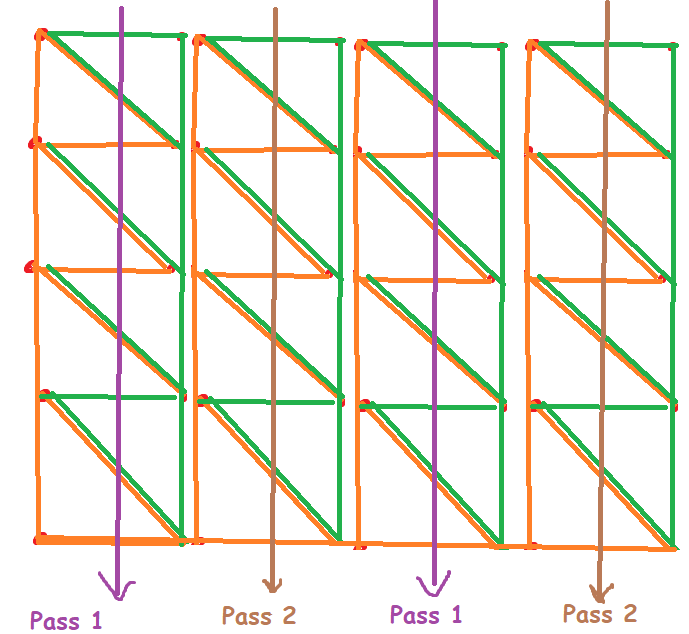

It is my attempt on cloth simulation. It uses compute shaders and verlet integration scheme.

The result looks like this:\

There is also a presentation of the process of making it on youtube: [https://www.youtube.com/watch?v=CWEgaY4PjSU](https://www.youtube.com/watch?v=CWEgaY4PjSU)

Here is a silly little diagram of how the work is distributed in the compute shader:

## Used libraries: 
- [GLFW](https://github.com/glfw/glfw#head1234)
- [GLAD](https://glad.dav1d.de/)
- [GLM](https://github.com/g-truc/glm)
- [DEAR IMGUI](https://github.com/ocornut/imgui)
- [STB_IMAGE](https://github.com/nothings/stb)